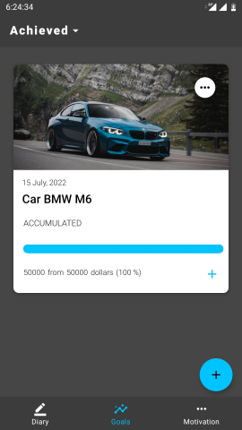

## Tracking Goals (en)

___Kotlin  -  MVVM  -  Clean Architecture  -  Jetpack Navigation component (Bottom navigation bar, safe args) -  Koin___   
___Room Database - Retrofit + OkHttp + GSON -  Kotlin Coroutines   -  View Binding  -  Glide  -  Workmanager  -  Notification  -  RecyclerView___

>Success is the sum of small efforts, repeated day in and day out.

The name Tracking Goals speaks for itself, the app helps you achieve your goals and monitor your progress. With it, your goal or task will not get lost in papers, diaries, and other places. All goals and progress on them will always be at your fingertips, no matter where you are.

Working with the app starts with setting a goal correctly in the goal builder. You can also add a picture for a goal from your gallery or choose from the ones offered by the app.

  

You can always edit created goals by clicking on ... in the right corner of the goal. Once the goal is achieved, you can change the goal's completion status and it will be moved to the achieved goals. Until you move a goal to achieved goals, it will remain in your active goals.

  

The Diary menu tab displays the current month with blank notes to fill in. You can create one or more entries each day. You can also choose a date for a new entry.

  

Once you've created a goal, it's recommended that each day you note in the app what you did during the day for your goal, noting how much was added or subtracted. You can do this either from the goal tab by clicking the + on the goal itself, or from the diary tab by adding in a note to which the goal applies.

 

You can read a new inspirational affirmation every day in the Motivation tab.

___

## Tracking Goals (ru)

___Kotlin  -  MVVM  -  Clean Architecture  -  Jetpack Navigation component (Bottom navigation bar, safe args)___   
___Room Database - Retrofit + OkHttp + GSON -  Kotlin Coroutines   -  View Binding  -  Glide  -  Workmanager  -  Notification  -  RecyclerView___

>Большой Успех - это сумма маленьких шажков, которые мы делаем ежедневно!

Название Tracking Goals говорит само за себя, приложение помогает достигать поставленные цели и контролировать процесс достижения. С ним ваша цель или задача, не затеряется в бумажках, ежедневниках и прочих местах. Все цели и прогресс по ним, всегда будут у вас под рукой, где бы вы не находились.

Работа с приложением начинается с правильной постановки цели в конструкторе. В нем также можно добавить изображение для цели из вашей галереи или выбрать из тех что предлагает приложение.

  

Созданные цели вы всегда сможете отредактировать, нажав на ... в правом уголке цели. После того как цель будет достигнута, можно изменить статус выполнения цели и она перенесётся в достигнутые. Пока вы не перенесёте цель в достигнутые, она будет находиться в ваших активных целях.

  

В меню "Дневник" отображается текущий месяц с пустыми заметками для заполнения. Вы можете каждый день создавать одну или несколько записей. Также можно выбрать дату для новой записи.

  

После создания цели, рекомендуется каждый день отмечать в приложении, что вы сделали в течение дня для своей цели, отметив сколько прибавилось или отнялось. Это можно сделать как с меню цели, нажав на + на самой цели, так и с меню дневник, добавив в заметку к какой цели относится.

        

В меню "Мотивация" каждый день вы можете прочитать новую вдохновляющую аффирмацию.

