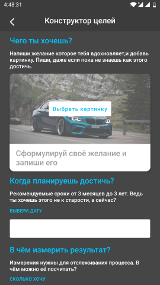

## Tracking Goals

```
В приложении использовались:
```
___Room Database -  Jetpack Navigation component - Retrofit - Kotlin Coroutines - ViewModel - View Binding - Glide - Workmanager - Notification___

>Большой Успех - это сумма маленьких шажков, которые мы делаем ежедневно!

Название Tracking Goals говорит само за себя, приложение помогает достигать поставленные цели и контролировать процесс достижения. С ним ваша цель или задача, не затеряется в бумажках, ежедневниках и прочих местах. Все цели и прогресс по ним, всегда будут у вас под рукой, где бы вы не находились.

Работа с приложением начинается с правильной постановки цели с помощью конструктора целей. В нем также можно добавить изображение для любой своей цели из галереи или из предложенных.

  

Созданные цели вы всегда сможете отредактировать, нажав на ... в правом уголке цели. После того как цель будет достигнута, можно изменить статус выполнения цели и она перенесётся в достигнутые. Пока вы не перенесёте цель в достигнутые, она будет находиться в ваших активных целях.

  

Вкладка меню "Дневник" нужна чтобы вы могли каждый день отмечать что вы сделали для своей цели. Также можно выбрать дату для новой записи.

  

После создания цели, рекомендуется каждый день отмечать в приложении, что вы сделали в течение дня для своей цели, отметив сколько прибавилось или отнялось. Это можно сделать как с вкладки цели, нажав на + на самой цели, так и из вкладки дневник, добавив в заметку к какой цели относится.

 

На вкладке "Мотивация" каждый день вы можете прочитать новую вдохновляющую аффирмацию.


